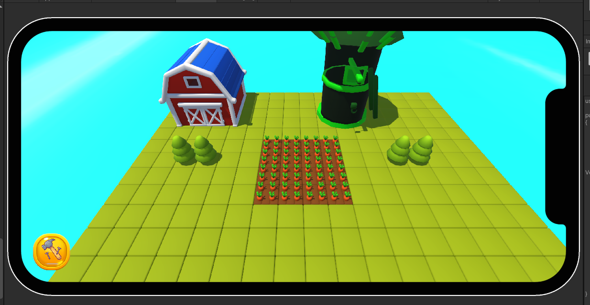
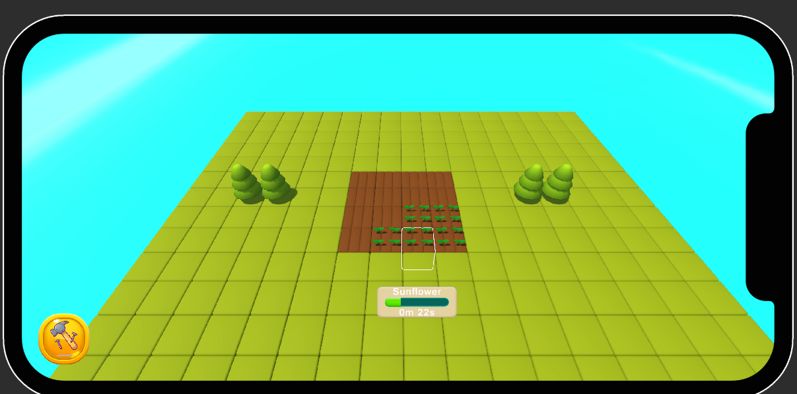
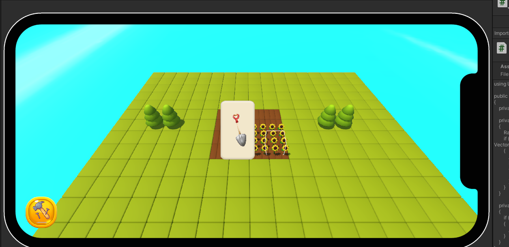
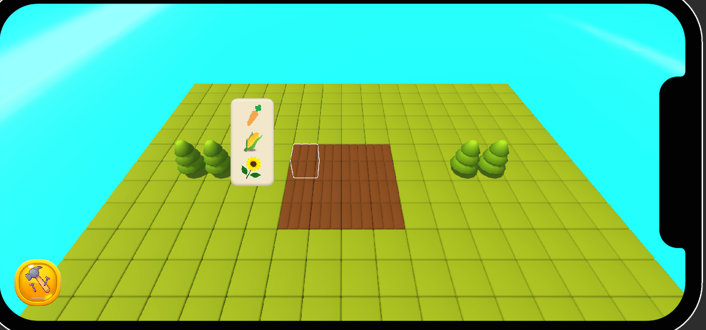
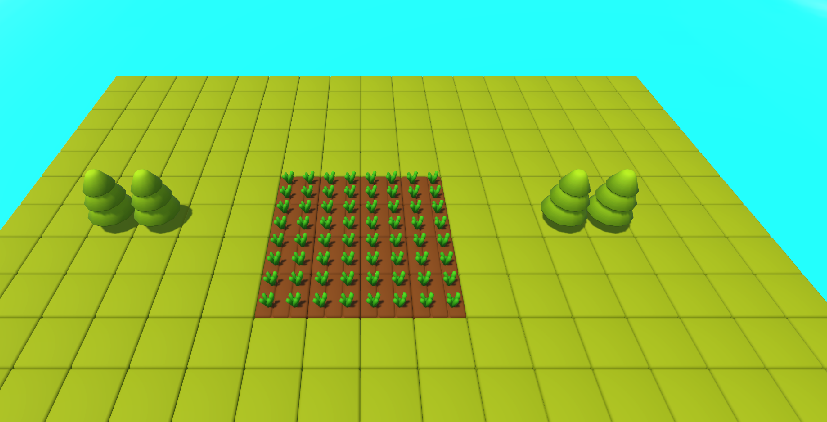
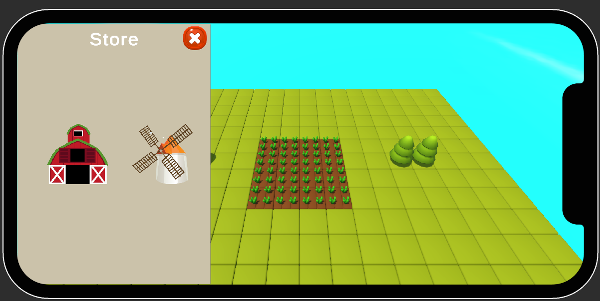
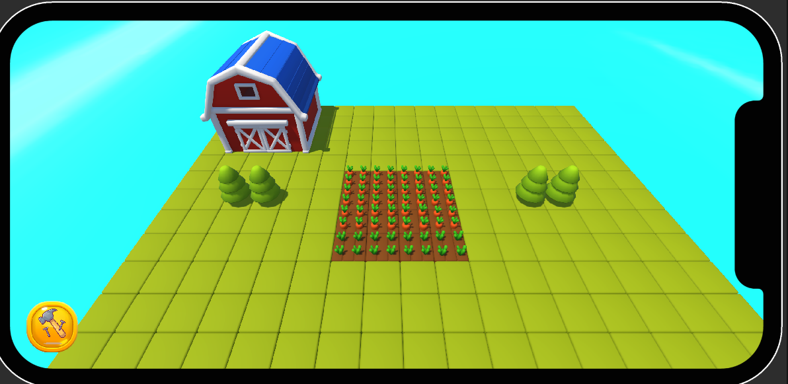
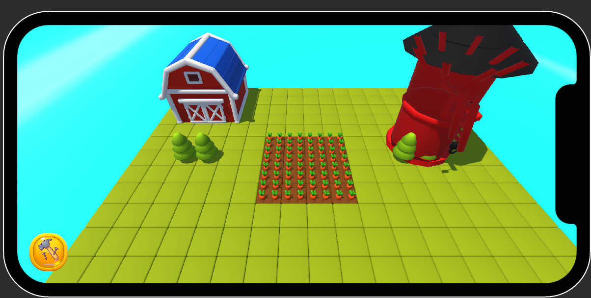

# wibesoftCase

 
## Project Overview
This is a farming & building simulation game with a grid-based system. Players can:

✅ Plant three different crops: Carrot, Corn, and Sunflower
✅ Drag & Drop crops onto farm grids
✅ Monitor crop growth and harvest them with animations
✅ Construct buildings on an interactive grid** (with size data)**
✅ Modify building placements by holding down for 2 seconds
✅ Visual placement indicators (green = valid, red = occupied)
✅ Obstacle-aware grid system to prevent placement on blocked tiles

## Technology Stack  
- **Unity** (Game Engine)  
- **C#** (Programming Language)  
- **Scriptable Objects** (Data Storage)  
- **DOTween** (Animation & Tweening)  

## System Architecture
Crop Growth System 🌱
BaseCrop (Abstract Class):
Manages crop growth over time.
Uses coroutines to update crop stages.
Animates growth with DOTween.
Supports smooth harvesting animations.
Easily expandable (Carrot, Corn, Sunflower exist currently).

## Farm Grid System 🏡
FarmGridCell:
Handles player interaction with farm plots.
Allows crop selection, planting, and harvesting.
Uses drag-and-drop mechanics for interaction.
Displays crop growth status on click.

## Building System 🏗️
Building Placement Mechanics:

Access the Store Panel (bottom left) to select a building.
Drag the building onto the grid.
Indicator feedback:
✅ Green = Valid placement.
❌ Red = Occupied area.
Hold for 2 seconds to relocate a placed building.
Building Grid System:

BuildingGridCell stores occupancy status.
If a cell is occupied, new buildings cannot be placed there.
Obstacle System:
Some objects (e.g., trees, rocks) automatically mark grid cells as occupied, preventing buildings from being placed.
Building Data System 📦
BuildingData (Scriptable Object):
Defines each building's grid size (e.g., 4x4 tiles).
Determines placement constraints on the farm grid.
Allows easy expansion for new buildings without modifying core scripts.

## How to Run the Project
Open the project in Unity 2021.3+
Plant crops on farm grid cells.
Watch crops grow and harvest them.
Enter the store, choose a building, and place it on the grid.
Modify building placements by holding them for 2 seconds.

## Gameplay Screenshots  
Here are some in-game visuals:  

  
  
  

